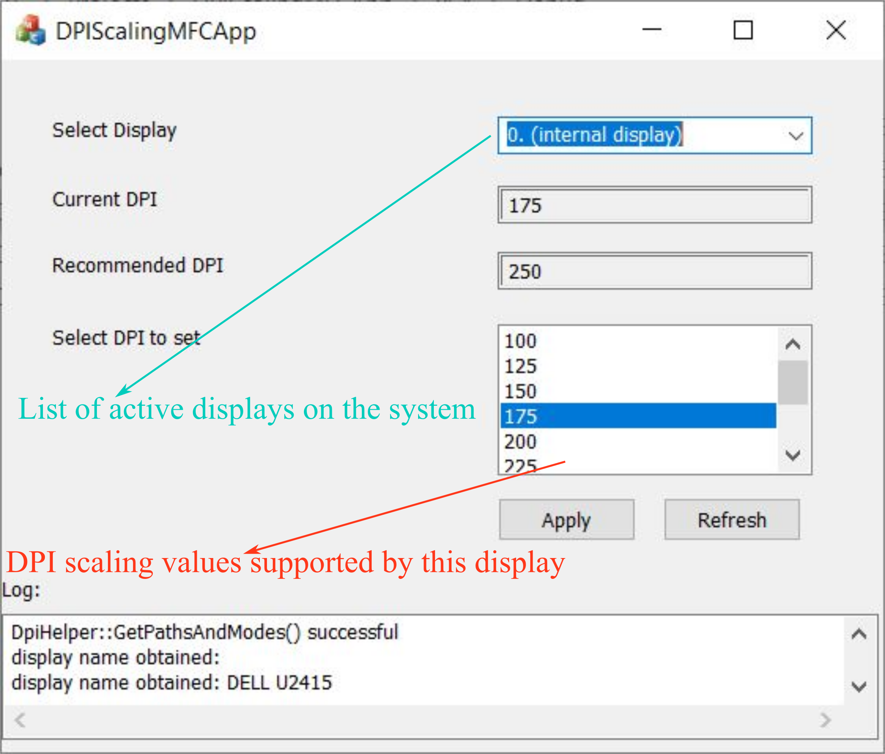
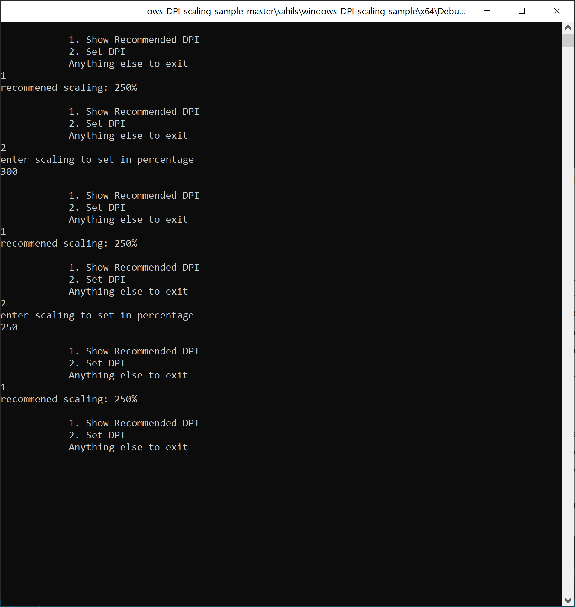

The visual studio solution constans 2 projects (3 projects now. see update 1. for command line version see update 2)

1. DPIHelper (static lib)
This is the helper library which contains class DpiHelper. This has functions for setting and getting DPI.
1. DPIScalingMFCApp
Here is how the app looks

The repo is based on the study I did by reverse engineering system settings app (immersive control panel), user32.dll (which contains the API used for DPI scaling).
For getting, and setting DPI scaling of a monitor DisplayConfigGetDeviceInfo(), and DisplayConfigSetDeviceInfo() functions are used.
These functions are public (their description is provided on msdn), but they use some undocumented parameters.
The values of type parameter used in DISPLAYCONFIG_DEVICE_INFO_HEADER is in nagative range (-3 for get, and -4 for set).
[DISPLAYCONFIG_DEVICE_INFO_TYPE](https://docs.microsoft.com/en-us/windows/win32/api/wingdi/ne-wingdi-displayconfig_device_info_type) as it is
documented by microsoft (and defined in wingdi.h) only contains non negative values. Thus the ability to get/set DPI
have been made hidden my Microsoft by not making these parameters public.
The structures used in DisplayConfigGet/SetDeviceInfo() are dependednt on value of type. Now since type isn't documented
these structures also have not been.

I used WinDbg, and ghidra (https://ghidra-sre.org/) in the reverse engineering effort. A big thanks to creators of ghidra!

If you want to set\get DPI scaling from your code, just use the DpiHelper class. The main methods i the class are
1. GetDPIScalingInfo(), and
1. SetDPIScaling()

## Update 2 : 28 Sep 2020
Command line version - https://github.com/imniko/SetDPI

A user created a command line version. I have not tested it but from the description given on the repo it seems great.
Do check it out.

## UPDATE 1 : 15 July 2020
Added a new project which uses OS API SystemParametersInfo() to set DPI.
This method is useful when trying to set DPI scaling for primary monitor 
in a multi monitor setup, or there is only a single display, as API is much simpler.
Compared to my earlier approach this suffers from some drawbacks though.

Pros wrt prev approach.
1. Very simple, thus when we are interested in setting DPI scaling for primary monitor only, or there is only a single monitor, this is quite favorable.
Cons wrt prev approach.
1. Cannot be used for setting per monitor DPI scaling in multi monitor setup
1. Does not give you currently applied DPI scaling
1. Does not tell max/min values of DPI scaling allowed for a monitor. However if you try to set beyond max, it will use max value.
